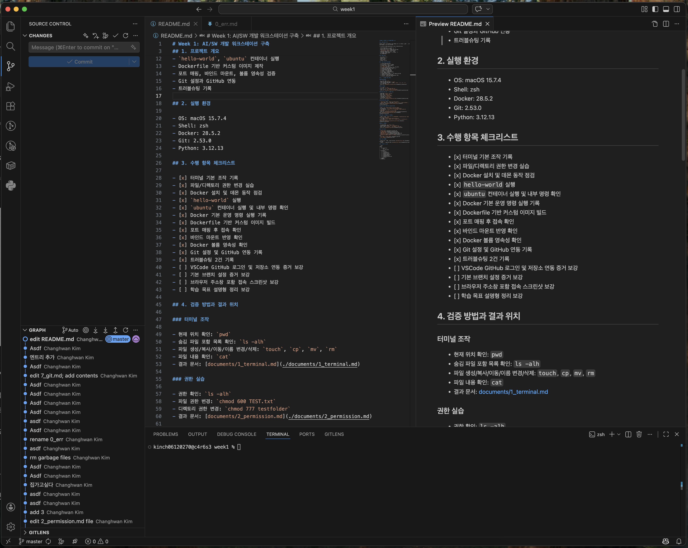

Subject 7: git 설정 및 github 연동
-----

> github 연동
```bash
kinch06120270@c4r6s3 week1 % git config --list
credential.helper=osxkeychain
user.name=Changhwan Kim
user.email=kimch061279@gmail.com
core.repositoryformatversion=0
core.filemode=true
core.bare=false
core.logallrefupdates=true
core.ignorecase=true
core.precomposeunicode=true
remote.origin.url=ssh://git@github.com/kimch0612/Codyssey_Week1
remote.origin.fetch=+refs/heads/*:refs/remotes/origin/*
branch.master.remote=origin
branch.master.merge=refs/heads/master
```

> VSCode GitHub 로그인 및 저장소 연동 화면

아래 이미지는 VSCode에서 GitHub 계정이 연결된 상태를 확인한 화면이다.



> 연결 결과
```bash
kinch06120270@c4r6s3 week1 % ssh -T git@github.com
Hi kimch0612! You've successfully authenticated, but GitHub does not provide shell access.

kinch06120270@c4r6s3 week1 % 
```

> Github로 작업 상태 전송
```bash
kinch06120270@c4r6s3 week1 % git add .

kinch06120270@c4r6s3 week1 % git commit -m "edit 7_git.md; add contents"
[master 1229b9c] edit 7_git.md; add contents
 1 file changed, 8 insertions(+)

kinch06120270@c4r6s3 week1 % git push
Enumerating objects: 7, done.
Counting objects: 100% (7/7), done.
Delta compression using up to 6 threads
Compressing objects: 100% (4/4), done.
Writing objects: 100% (4/4), 511 bytes | 511.00 KiB/s, done.
Total 4 (delta 3), reused 0 (delta 0), pack-reused 0 (from 0)
remote: Resolving deltas: 100% (3/3), completed with 3 local objects.
To ssh://github.com/kimch0612/Codyssey_Week1
   2063952..1229b9c  master -> master

kinch06120270@c4r6s3 week1 % 
```

> Github 로그 확인
```bash
# git log

commit 1229b9c1dff0d8f93b0d2ecef7700fda939ad121 (HEAD -> master, origin/master)
Author: Changhwan Kim <kimch061279@gmail.com>
Date:   Tue Mar 31 11:24:27 2026 +0900

    edit 7_git.md; add contents

commit 206395221f8050da05ad537f580a6bd05bc0e97b
Author: Changhwan Kim <kimch061279@gmail.com>
Date:   Tue Mar 31 11:22:36 2026 +0900

    Asdf

commit 9be538aad32dc0b9b9df411603d1e52c38c753ea
Author: Changhwan Kim <kimch061279@gmail.com>
Date:   Tue Mar 31 11:15:18 2026 +0900
:
```
